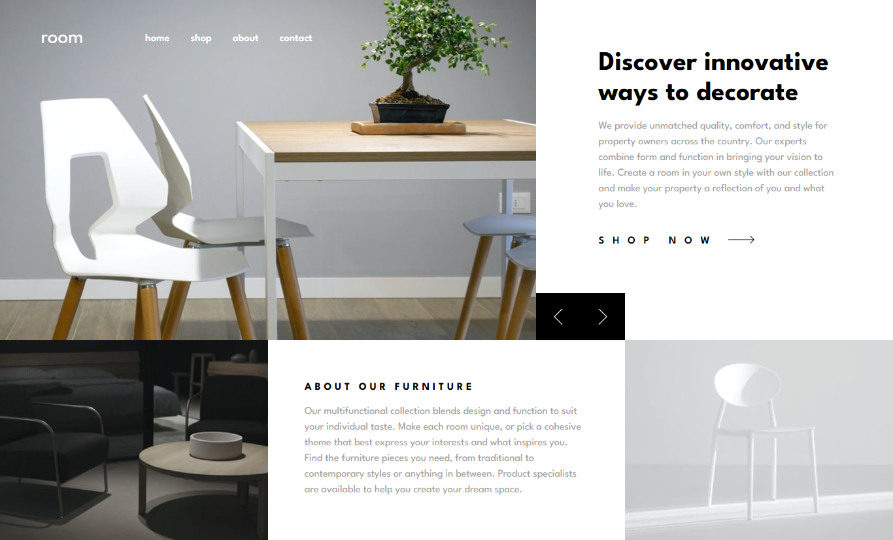

# Frontend Mentor - Room homepage solution

This is a solution to the [Room homepage challenge on Frontend Mentor](https://www.frontendmentor.io/challenges/room-homepage-BtdBY_ENq). Frontend Mentor challenges help you improve your coding skills by building realistic projects.

## Table of contents

- [Overview](#overview)
  - [The challenge](#the-challenge)
  - [Screenshot](#screenshot)
  - [Links](#links)
- [My process](#my-process)
  - [Built with](#built-with)
  - [What I learned](#what-i-learned)
- [Author](#author)

**Note: Delete this note and update the table of contents based on what sections you keep.**

## Overview

### The challenge

Users should be able to:

- View the optimal layout for the site depending on their device's screen size
- See hover states for all interactive elements on the page
- Navigate the slider using either their mouse/trackpad or keyboard

### Screenshot

### Links

- Solution URL: [Frontend Mentor Solution](https://www.frontendmentor.io/solutions/room-homepage-nIl-gWY8_u)
- Live Site URL: [Room Homepage](https://gustavo2023.github.io/room-homepage/)

## My process

### Built with

- Semantic HTML5 markup
- CSS custom properties
- Flexbox
- CSS Grid
- Mobile-first workflow
- JavaScript
- Sass
- BEM

### What I learned

- **Grid “stacking” pattern for the hero slides:** overlap items in the same grid cell and animate opacity instead of toggling display, preserving layout.
- **Mobile nav:** proper aria-expanded, focus trap, overlay click-to-close, and focus return to the toggle.
- **Carousel:** toggle `aria-hidden` per slide, announce changes via an `aria-live` status node, make the gallery focusable (`tabindex="0"`), and support ArrowLeft/ArrowRight.
- Honored prefers-reduced-motion to disable non-essential animations.
- DOM guard clauses prevent runtime errors on partial renders.
- Data attributes co-locate content with slides; UI text is derived from data-title/data-description.
- Implemented wrap-around indexing for robust prev/next navigation.

## Author

- Frontend Mentor - [@gustavo2023](https://www.frontendmentor.io/profile/gustavo2023)
